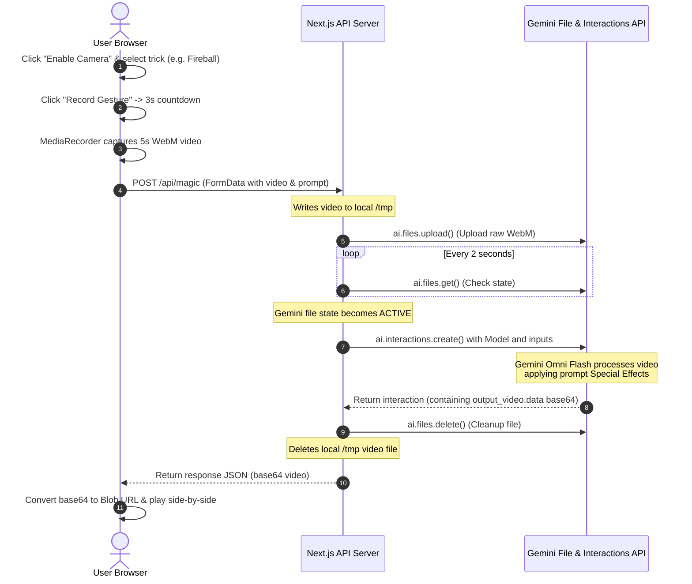

# AI Magic Trick Creator 🔮

AI Magic Trick Creator is a modern, single-page web application built with **Next.js 15 (App Router)** and **Tailwind CSS v4**. It allows users to record a short 5-second video gesture (such as reaching their palm toward the camera) and leverages the stateful **Google Gemini Omni Flash (`gemini-omni-flash-preview`) Interactions API** to generate special-effect video edits with realistic physics, lighting, and shadow reflections.

The interface is built following a **Premium Minimal UI Design** language, drawing inspiration from high-end SaaS products like Vercel and Linear.

---

## Key Features

- 📹 **In-Browser Video Capture**: Integrates `MediaDevices` and the `MediaRecorder` API to mirror and record user webcams directly.
- 🎯 **Target Guides & Countdown**: Displays a dashed hand silhouette guide and a 3-second visual countdown to ensure correct user positioning.
- 🪄 **Pre-Configured Magic Presets**:
  - **Glowing Butterfly**: A realistic 3D glowing butterfly emerges from the user's palm, casting glowing reflections onto the fingers.
  - **Fireball Conjuring**: A crackling sphere of fire hovers and grows above the palm, casting dynamic warm light and shadows onto the hand and face.
  - **Object Disappearance**: A small item held in the palm completely vanishes when the hand is opened.
  - **Custom Magic**: A text input to describe any arbitrary magic trick for Gemini to render.
- 🤖 **Interactions API Orchestration**: Node.js backend handles multi-step Gemini processes: uploading to the Gemini File API, polling file processing states, invoking the Interactions API, and cleaning up temporary assets.
- 🌓 **Aesthetics & Performance**: Lightweight dark-mode interface featuring a 2% opacity grid background, spotlight radial gradients, horizontal scanner animations, and skeleton shimmer loading indicators.

---

## Technical Architecture

Below is the interaction sequence:



---

## Codebase Layout

```
.
├── postcss.config.mjs        # PostCSS configuration for Tailwind CSS v4
├── package.json              # Project dependencies and run scripts
├── tsconfig.json             # TypeScript compiler settings
└── src/
    └── app/
        ├── layout.tsx        # HTML root wrap and background spotlight containers
        ├── globals.css       # Tailwind imports, linear grids, scanner keyframes
        ├── page.tsx          # Client-side camera controller and dashboard UI
        └── api/
            └── magic/
                └── route.ts  # Node.js API Route for Gemini Interactions API
```

---

## Setup & Running Locally

### 1. Prerequisites
- **Node.js** (v18.0.0 or higher recommended)
- **Gemini API Key**: Access token for Google AI Studio.

### 2. Configure Environment Variable
Set your Gemini API Key in your terminal session before launching the server:

```bash
export GEMINI_API_KEY="your-actual-gemini-api-key"
```

### 3. Installation
Install project dependencies:

```bash
npm install
```

### 4. Run Development Server
Launch the local Next.js server:

```bash
npm run dev
```

Open [http://localhost:3000](http://localhost:3000) in your web browser.

---

## Verification Guide

1. **Enable Camera**: Click the **Enable Camera** action button and accept browser permissions.
2. **Select Effect**: Choose a preconfigured magic preset (e.g. *Glowing Butterfly*).
3. **Align Hand**: Align your hand inside the dashed target frame.
4. **Record Gesture**: Click **Record Gesture**. Strike a pose during the 3s countdown, hold it for the 5s capture, and watch the scanning loader start.
5. **View Results**: Compare the original setup vs. the edited magic output side-by-side. Download the generated MP4 file or repeat for a new trick.
